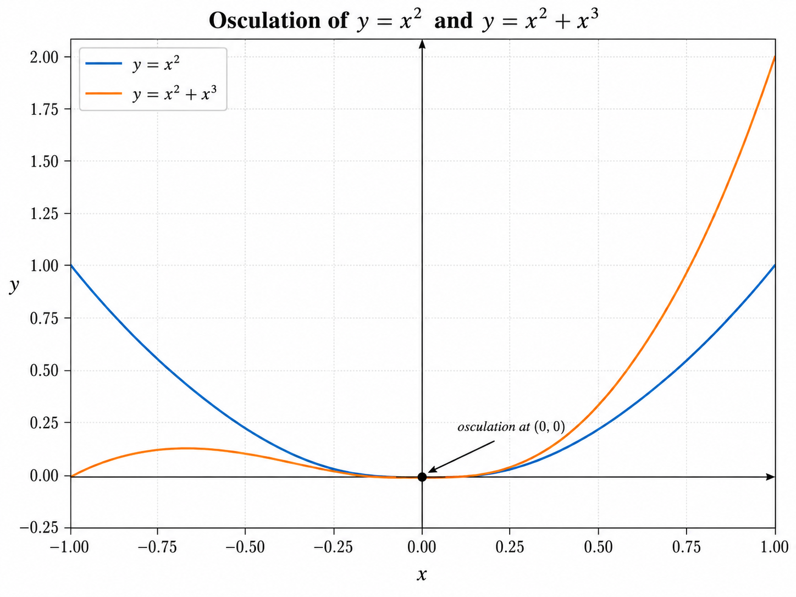

Welcome to **The Osculatorium** — a place for exploring mathematics, solving problems, and discovering how mathematical ideas connect.

## What is this?

**The Osculatorium** is a growing mathematics resource I created for my students. It contains Questions of the Day, practice questions, mathematical notes and examples, class information, frequently asked questions, and other resources that may be useful throughout the semester.

*This site is still under active development. Pages, links, wording, and organization may change as the resource grows, and new material will continue to be added.*

It is not intended to be a textbook, and it is not meant to replace what happens in class. Think of it instead as a **growing mathematical reference**: a place where questions, ideas, examples, and connections can accumulate over time. Some pages deal directly with how our class operates, while others contain mathematics that may be useful for practice, review, or simply exploring an idea a little further.

---

## Why “The Osculatorium”?

The name comes from the mathematical word **osculation**. Imagine two curves that come together and, for a short time, fit each other extremely closely before separating again. They don't simply cross: they **meet, follow one another closely, and then continue on their own paths.**

Mathematicians call this *osculation*. The word comes from the Latin *osculum*, meaning **“a little kiss.”** Mathematics has therefore given us a rather wonderful word for two curves that meet this closely: they are *kissing*.

That's where the name **The Osculatorium** comes from. **It's a place where mathematical ideas meet.**

---

## Mathematics is connected

Mathematics can sometimes feel like a collection of separate topics — fractions, algebra, graphs, geometry, trigonometry, functions, exponents, calculus — but these ideas don't live in separate boxes. They constantly connect to one another.

A skill you learned last year may suddenly become important again. One problem might combine several different skills. An idea from algebra might appear in geometry, and something you learn about graphs may later become important in calculus. A new mathematical idea is almost always connected to something that came before it.

That idea is central to **The Osculatorium**. The questions on this site are not meant to exist as isolated exercises; over time, they form a network. A question may depend on an earlier question, connect to another idea worth exploring, or lead toward something you have not learned yet.

If you're struggling because you've forgotten an earlier skill, follow the connection backwards, review the earlier idea, and then return and try again. If you've mastered a question, follow the connections forward and see where the idea leads. The goal is not simply to collect mathematics questions, but to make the **connections between mathematical ideas visible**.

The **[[Math/QOD Map|QOD Learning Map]]** is one way to follow those connections. If you want a broader view, you can also explore the [[QOD Graph|published QODs as an interactive network]].

---

## Using this site

If you have a question about how our class operates — attendance, QODs, exams, calculators, missed assessments, academic honesty, or other course policies — start with the **[[Frequently Asked Questions|Frequently Asked Questions (FAQ)]]**.

If you want practice, explore the Questions of the Day. When a question gives you trouble, its **Review First** connections point toward earlier ideas that may help. **Explore Also** leads to related mathematics, while **Builds Toward** shows where the idea may lead next.

Getting stuck on a problem does not always mean that the current idea is the problem. Sometimes the missing piece is several connections further back. That is exactly what the network is there to help you find.

---

## Curious about the mathematics behind the name?

The basic idea of osculation is simple: two curves can meet and follow one another extremely closely before separating again. If you are curious about what makes that happen mathematically, the sections below take the idea a little further.

> [!info]- Go deeper: A closer mathematical look
>
> ## Looking more closely at osculation
>
> Consider these two functions:
>
> $$
> f(x)=x^2
> $$
>
> and
>
> $$
> g(x)=x^2+x^3.
> $$
>
> 
>
> *The curves $y=x^2$ and $y=x^2+x^3$ meet at the origin and follow one another extremely closely near the point of contact.*
>
> At $x=0$, both functions have the same value:
>
> $$
> f(0)=g(0)=0.
> $$
>
> Both curves therefore pass through the origin. Simply passing through the same point is not particularly unusual, however. What makes these curves interesting is how closely they agree there.
>
> Their first derivatives are
>
> $$
> f'(x)=2x
> $$
>
> and
>
> $$
> g'(x)=2x+3x^2.
> $$
>
> Therefore,
>
> $$
> f'(0)=g'(0)=0.
> $$
>
> The two curves have the same tangent line at the origin, but they agree even more closely than that. Their second derivatives are
>
> $$
> f''(x)=2
> $$
>
> and
>
> $$
> g''(x)=2+6x,
> $$
>
> so
>
> $$
> f''(0)=g''(0)=2.
> $$
>
> At the origin, the two curves therefore share the same **position**, the same **direction**, and the same **curvature**. Close to $x=0$, their graphs fit together extremely closely before eventually separating. That is the mathematical idea behind **osculation**.

> [!abstract]- Go deeper still: How closely can two curves meet?
>
> ## How closely can two curves meet?
>
> The example
>
> $$
> f(x)=x^2
> $$
>
> and
>
> $$
> g(x)=x^2+x^3
> $$
>
> reveals something deeper. At $x=0$,
>
> $$
> f(0)=g(0),
> $$
>
> $$
> f'(0)=g'(0),
> $$
>
> and
>
> $$
> f''(0)=g''(0).
> $$
>
> But their third derivatives are different. For
>
> $$
> f(x)=x^2,
> $$
>
> we have
>
> $$
> f'''(x)=0,
> $$
>
> while for
>
> $$
> g(x)=x^2+x^3,
> $$
>
> we have
>
> $$
> g'''(x)=6.
> $$
>
> The two functions therefore agree through their second derivatives, but not their third. This is an example of **higher-order contact**: the more derivatives two sufficiently smooth functions share at a point, the more closely their graphs resemble one another near that point.
>
> This idea leads naturally to **Taylor polynomials**. A Taylor polynomial is constructed so that a polynomial and a function have the same value and the same first several derivatives at a chosen point. In that sense, a Taylor polynomial is designed to **osculate** the function it approximates. As more derivatives are matched, the polynomial captures more of the local behaviour of the original function near the point of contact.
>
> So the idea behind the name **The Osculatorium** reaches surprisingly far into calculus: **mathematical objects meeting, agreeing, and following one another closely — before eventually taking different paths.**

---

**The Osculatorium** was created and is maintained by **Dr. Mario Pineda** for his mathematics students.

